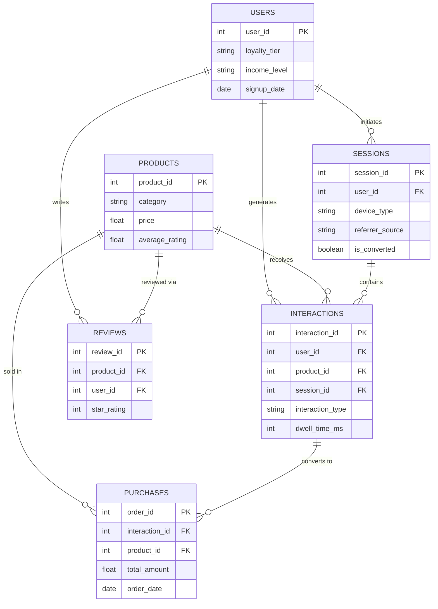

# E-Commerce Product Intelligence — End-to-End Data Analytics Project
> *An end-to-end analysis of 133,305 e-commerce records across six relational tables — using Python, SQL, and Power BI — to quantify a 73.25% cart abandonment problem and identify which marketing channels and product categories actually drive revenue.*

---

## ⚙️ Project Type Flags

- [x] Exploratory Data Analysis (EDA)
- [x] SQL Analysis / Querying
- [x] Dashboard / Data Visualization
- [ ] Data Pipeline / ETL
- [ ] Predictive Modelling / Machine Learning
- [ ] Data Cleaning / Wrangling
- [x] End-to-End (multiple of the above)
- [ ] Other: ___________

---

## Table of Contents
1. [Project Overview](#1-project-overview)
2. [Objectives](#2-objectives)
3. [Project Scope & Tools](#3-project-scope--tools)
4. [Repository Structure](#4-repository-structure)
5. [Data Workflow](#5-data-workflow)
6. [Data Model & Schema](#6-data-model--schema)
7. [ERD - Entity Relationship Diagram](#7-erd--entity-relationship-diagram)
8. [Analysis & Metrics](#8-analysis--metrics)
9. [Key Insights](#9-key-insights)
10. [Recommendations](#10-recommendations)
11. [Assumptions & Limitations](#11-assumptions--limitations)
12. [Future Enhancements](#12-future-enhancements)
13. [Deliverables](#13-deliverables)
14. [Author](#14-author)

---

## 1. Project Overview

**Context:** E-commerce platforms generate continuous streams of transactional and behavioral data — every product view, cart addition, purchase, and review leaves a digital trace. Left unanalyzed, that data can't answer the questions that actually drive business decisions: which marketing channels are worth the spend, why customers abandon their carts, which products deserve more shelf space, and which customer segments are most valuable.

**Problem Statement:** Using a synthetic but realistic e-commerce dataset (six relational tables, 133,305 records, January 2023–May 2026), determine where customers drop out of the purchase journey, which channels and categories drive revenue most efficiently, and how customer segments differ in value.

**Approach:** The project was executed in three connected phases, each feeding the next — Python for exploratory analysis and validation, SQL for structured business querying, and Power BI for interactive dashboard delivery.

**Outcome:** A healthy 7.46% session-to-purchase conversion rate sits alongside a severe 73.25% cart abandonment rate. Electronics is the dominant revenue category (31.1% of total revenue), and marketing channels split into two distinct value types: display advertising converts best per session despite carrying the smallest traffic share, while organic search drives the most total revenue through volume alone. All three findings were independently derived in both Python and SQL before being operationalized as live DAX measures in Power BI.

---

## 2. Objectives

- **Primary Objective:** Identify and quantify the cart abandonment problem and its underlying drivers.
- **Secondary Objective 1:** Evaluate marketing channel effectiveness across conversion rate, revenue, and efficiency.
- **Secondary Objective 2:** Assess product and category performance, including the relationship between ratings and revenue.
- **Secondary Objective 3:** Build a reliable, validated understanding of the dataset through exploratory analysis in Python, translate business questions into structured SQL queries, and design an interactive Power BI dashboard for ongoing monitoring.

> 💡 *Every analysis decision in this project traces back to one of these objectives.*

---

## 3. Project Scope & Tools

### Scope

| Dimension | Details |
|-----------|---------|
| **In Scope** | Six relational tables covering customer demographics, website sessions, product catalog, granular interactions, purchases, and reviews, spanning January 2023–May 2026. |
| **Out of Scope** | Predictive/ML modelling and automated pipeline scheduling — this project focused on descriptive/diagnostic analysis (funnel, revenue, abandonment) rather than forecasting. |
| **Time Period** | January 2023 – May 2026 (3.5 years) |
| **Granularity** | Row-level transactional and event data (sessions, interactions, purchases, reviews), aggregated to category, channel, device, and customer-segment level for reporting. |

### Tools & Technologies

| Category | Tool(s) Used |
|----------|-------------|
| Data Storage | CSV files (six relational source tables) |
| Data Processing | Python, SQL |
| Analysis | pandas, MySQL (SQL validation), CTEs, window functions, multi-table joins |
| Visualization | matplotlib, seaborn, Microsoft Power BI (Power Query, DAX) |
| Version Control | Git / GitHub |
| Documentation | Markdown, Word (project report) |
| Other | Jupyter Notebook |

---

## 4. Repository Structure

```
ecommerce-product-intelligence/
│
├── data/
│   ├── raw/                  # Original six CSV source tables (users, products, sessions,
│   │                         #   interactions, purchases, reviews) - never edited          
│   └── processed/            # Cleaned tables output from Python (*_cleaned)
│
├── notebooks/                # Python EDA notebook - funnel construction, revenue/channel/
│                             #   demographic analysis, dwell-time and rating analysis
│
├── power bi/                     # Data dictionary / schema notes (Section 6 below)                           
│
├── queries/                  # SQL scripts (validated in MySQL)
│   ├── exploratory/          # Ad-hoc business queries (revenue by category, top products)
│   ├── transformations/      # Channel deep-dive scripts (display ad, organic search)
│   └── final/                # Cart abandonment analysis (CTE-based set-difference query)
│
├── reports/                  # E-Commerce_Project_Report.docx (full narrative write-up)
│
├── visuals/                  # Power BI dashboard screenshots (4 pages), ERD diagrams, Other screenshorts
│
│
└── README.md                 # You are here
```

> Power BI (.pbix) file lives at the project root or in a dedicated `powerbi/` folder if preferred — add it there once exported.

---

## 5. Data Workflow

```
[6 relational CSV tables: users, products, sessions,
 interactions, purchases, reviews]
      ↓
[Loaded into pandas (Python) / read directly by DuckDB (SQL)]
      ↓
[Power Query cleaning: dedupe, trim/standardize text, type conversion,
 referential-integrity validation]
      ↓
[Funnel construction, SQL business querying, DAX measure development]
      ↓
[Jupyter notebook visuals · SQL result tables · 4-page Power BI dashboard]
```

1. **Source:** Six relational CSV datasets totaling 133,305 rows — `users` (10,000), `products` (1,000), `sessions` (19,315), `interactions` (100,000), `purchases` (1,737), `reviews` (1,253).
2. **Ingestion:** Loaded into pandas DataFrames for Python analysis; read directly from CSV by MySQL for SQL validation; imported via Power Query for the Power BI model.
3. **Cleaning:** No missing values or malformed rows were found in the raw CSVs. In Power Query: removed duplicate records, trimmed/cleaned text fields, standardized text casing (`Text.Proper`) on categorical fields (device_type, referrer_source, category, loyalty_tier), converted date/time columns to proper types, and validated referential integrity before establishing model relationships.
4. **Transformation:** Datetime parsing applied across all date columns (signup_date, date_added, start_time, timestamp, order_date, review_date) to enable time-series analysis; funnel stages computed as unique user counts joined across interactions, sessions, and purchases; category- and channel-level revenue aggregations built for both SQL and DAX.
5. **Analysis:** Exploratory statistics and visual EDA in Python (funnel, revenue, channel, demographic, dwell-time, review, and cold-start analysis); structured SQL querying (CTEs, window functions, multi-table joins) for category revenue, top products, referrer conversion, and cart abandonment; 50+ DAX measures built on a star-schema-oriented Power BI model.
6. **Output:** Jupyter notebook with visual EDA, three SQL deliverable scripts (general business queries, channel deep-dives, cart abandonment analysis), a 4-page interactive Power BI dashboard, and a consolidated Word project report.

---

## 6. Data Model & Schema

### Dataset / Table: `users`

| Field Name | Data Type | Description | Example Value |
|------------|-----------|-------------|---------------|
| `user_id` | int | Unique customer identifier (primary key) | `1042` |
| `age`, `gender`, `country`, `city` | mixed | Customer demographics | `"US"`, `"NY"` |
| `signup_date` | date | Date the customer registered | `2023-04-12` |
| `income_level` | string | Customer income bracket | `"very high"` |
| `preferred_category` | string | Self-reported preferred product category | `"Electronics"` |
| `loyalty_tier` | string | Loyalty program tier | `"Bronze"` / `"Platinum"` |

> **Row count:** 10,000 · **Date range:** signups Jan 2023 – May 2026 · **Key relationship:** referenced by `sessions`, `interactions`, `purchases`, and `reviews` via `user_id`.

### Dataset / Table: `products`

| Field Name | Data Type | Description | Example Value |
|------------|-----------|-------------|---------------|
| `product_id` | int | Unique product identifier (primary key) | `205` |
| `name`, `description` | string | Product name and description | `"Apple Book4 Ultrabook"` |
| `category`, `subcategory`, `brand` | string | Product taxonomy | `"Electronics"` |
| `price` | float | Unit price | `530.00` |
| `average_rating`, `review_count` | float / int | Aggregate rating stats | `4.17`, `1253` |
| `stock` | int | Units in stock | `140` |

> **Row count:** 1,000 · **Key relationship:** referenced by `interactions`, `purchases`, and `reviews` via `product_id`.

### Dataset / Table: `sessions`

| Field Name | Data Type | Description | Example Value |
|------------|-----------|-------------|---------------|
| `session_id` | int | Unique website visit identifier (primary key) | `88213` |
| `user_id` | int | Customer who initiated the session | `1042` |
| `device_type` | string | Device used | `"mobile"` |
| `referrer_source` | string | Marketing channel that drove the session | `"Organic search"` |
| `start_time` | datetime | Session start timestamp | `2024-11-03 14:22:00` |
| `is_converted` | boolean | Whether the session ended in a purchase | `TRUE` |

> **Row count:** 19,315 · **Key relationship:** `sessions.session_id` ← `interactions.session_id`; `sessions.user_id` → `users.user_id`.

### Dataset / Table: `interactions`

| Field Name | Data Type | Description | Example Value |
|------------|-----------|-------------|---------------|
| `interaction_id` | int | Unique event identifier (primary key) | `550213` |
| `user_id`, `product_id`, `session_id` | int | Foreign keys to users, products, sessions | — |
| `interaction_type` | string | Event type | `"view"` / `"click"` / `"add_to_cart"` / `"Wishlist"` |
| `dwell_time_ms` | int | Time spent on the product page, in milliseconds | `19520` |

> **Row count:** 100,000 · **Key relationship:** the active bridge table connecting `products`, `sessions`, `users`, and `purchases` (via `interaction_id`) in the Power BI model.

### Dataset / Table: `purchases`

| Field Name | Data Type | Description | Example Value |
|------------|-----------|-------------|---------------|
| `order_id` | int | Order identifier | `4021` |
| `interaction_id`, `product_id`, `user_id`, `session_id` | int | Foreign keys | — |
| `quantity` | int | Units purchased in the line item | `2` |
| `unit_price`, `total_amount` | float | Line-item pricing | `61.63`, `123.26` |
| `order_date` | date | Date of purchase | `2025-02-18` |

> **Row count:** 1,737 line items (1,000 unique orders) · **Key relationship:** joins to `products` via `product_id`; joins to `users`/`sessions` indirectly through `interactions.interaction_id`.

### Dataset / Table: `reviews`

| Field Name | Data Type | Description | Example Value |
|------------|-----------|-------------|---------------|
| `review_id` | int | Unique review identifier (primary key) | `9012` |
| `product_id`, `user_id` | int | Foreign keys to products and users | — |
| `star_rating` | int | Rating from 1–5 | `5` |
| `review_title`, `review_text` | string | Review content | — |
| `review_date` | date | Date the review was submitted | `2025-06-30` |

> **Row count:** 1,253 · **Key relationship:** `reviews.product_id` → `products.product_id`; `reviews.user_id` → `users.user_id`.

---

## 7. ERD - Entity Relationship Diagram

### Option C - Mermaid Diagram *(renders on GitHub)*


---

**Table Relationships Summary:**

| Relationship | Join Key | Type | Status (Power BI model) |
|-------------|----------|------|--------------------------|
| `interactions` → `products` | `product_id` | Many-to-One | Active |
| `interactions` → `sessions` | `session_id` | Many-to-One | Active |
| `interactions` → `users` | `user_id` | Many-to-One | Active |
| `purchases` → `interactions` | `interaction_id` | Many-to-One | Active |
| `purchases` → `products` | `product_id` | Many-to-One | Inactive |
| `purchases` → `sessions` | `session_id` | Many-to-One | Inactive |
| `purchases` → `users` | `user_id` | Many-to-One | Inactive |
| `reviews` → `products` | `product_id` | Many-to-One | Active |
| `reviews` → `users` | `user_id` | Many-to-One | Active |
| `sessions` → `users` | `user_id` | Many-to-One | Inactive |

> **Model note:** Several direct relationships from `purchases` and `sessions` to `users` are inactive by design, with `interactions_cleaned` serving as the active bridge table. Every purchase row's `interaction_id` was confirmed to resolve correctly through this indirect path, so all customer-segmented revenue measures return accurate results. `USERELATIONSHIP()` remains available as a hardening option for any measure that needs the direct path explicitly.

---

## 8. Analysis & Metrics

### Analytical Approach

The project combined exploratory analysis, structured business querying, and dashboard delivery. Python was used to explore patterns and validate the dataset end-to-end (funnel construction, revenue/channel/demographic breakdowns, dwell-time and rating analysis, cold-start checks). SQL was used to translate specific business questions into structured, auditable queries (revenue by category, top products by category, referrer conversion, and — the most consequential deliverable — a set-difference cart abandonment analysis). Power BI operationalized both phases' validated findings into 50+ DAX measures across a star-schema-oriented model with four report pages.

### Key Metrics Defined

| Metric | Plain-Language Definition | Why It Matters |
|--------|--------------------------|----------------|
| `Session Conversion Rate` | Converted sessions ÷ total sessions (7.46%) | Baseline health check on how effectively traffic turns into purchases. |
| `Cart Abandonment Rate` | Users who added to cart but never purchased ÷ all users who added to cart (73.25%) | The single largest loss point in the funnel — identifying and reducing it is the project's core business case. |
| `Revenue by Category` | Total purchase revenue summed and ranked by product category, with % of total revenue | Identifies where revenue concentrates (Electronics: 31.1%) to guide marketing and inventory focus. |
| `Conversion Rate by Referrer Source` | Converted sessions ÷ total sessions, grouped by marketing channel | Separates channels that convert efficiently (display ads) from channels that win on volume (organic search). |
| `Average Order Value` | Total revenue ÷ total unique orders ($89.94) | Standard order-economics benchmark for tracking revenue efficiency over time. |
| `Revenue Per Session` (channel efficiency) | Revenue attributable to a channel ÷ sessions from that channel | Distinguishes channel *quality* (efficiency) from channel *scale* (total volume). |

### Methods Used

- Descriptive statistics — distribution, aggregation, and comparison across category, channel, device, and customer segment
- Full-funnel construction from registration → session → view → click → cart → purchase → review, with stage-by-stage drop-off
- Cart abandonment analysis using a `LEFT JOIN` / `IS NULL` set-difference pattern between carted and purchased users
- SQL window functions (`RANK() OVER PARTITION BY category`) to rank products fairly within their own category
- Segmentation / group comparison by device type, referrer source, loyalty tier, and income level
- Price-sensitivity and dwell-time comparison between abandoners and purchasers to test (and rule out) competing hypotheses
- 50+ DAX measures across revenue, orders, customers, funnel, cart abandonment, sessions/channels, products, and reviews

---

## 9. Key Insights

**Insight 1: Cart abandonment is the #1 loss point in the funnel**
73.25% of users who add an item to cart never purchase (3,524 of 4,811 cart users) — the single largest drop-off in the entire funnel, larger than any acquisition or engagement gap. This redirected the project's analytical focus away from top-of-funnel acquisition and toward the cart-to-purchase transition specifically.

**Insight 2: Price and engagement are not the abandonment drivers**
Abandoned and purchased products carry almost identical average prices ($61.63 vs. $64.26) and near-identical dwell times (18.86s vs. 19.52s). Ruling out price sensitivity and disengagement points toward checkout friction — most pronounced on mobile — as the more likely root cause.

**Insight 3: Mobile carries a disproportionate share of the abandonment burden**
Mobile sessions account for the largest share of unique cart abandoners (3,240), well ahead of desktop (2,050) and tablet (752), despite mobile also being the dominant traffic source (57% of all sessions). This makes mobile checkout UX the highest-leverage place to intervene.

**Insight 4: Electronics dominates revenue but under-indexes organically**
Electronics drives 31.1% of total revenue but only 28.5% of organic-search revenue — it converts disproportionately better through paid and direct channels, while Home & Kitchen over-indexes on organic search (+3.23 percentage points), suggesting stronger organic purchase intent for that category specifically.

**Insight 5: Display ads and organic search represent two different kinds of channel value**
Display advertising converts best per session (8.05%) despite carrying only 2% of total session volume, while organic search generates the most absolute revenue ($45,729) purely through traffic scale (36% of sessions). Treating these as complementary rather than competing investments changes how channel budget should be allocated.

**Insight 6: Customer value follows income more strongly than loyalty tier alone**
Very-high-income customers spend 7x more per transaction than low-income customers ($196 vs. $28) — a starker and more actionable differentiator than loyalty tier in isolation, where Bronze-tier customers drive the majority of revenue by volume while Platinum-tier customers spend more per transaction ($85 vs. $28).

---

## 10. Recommendations

| Priority | Recommendation | Based On | Suggested Owner |
|----------|---------------|----------|-----------------|
| High | Launch targeted abandoned-cart email and retargeting campaigns, prioritized using the dashboard's abandoner segmentation — starting with high-intent abandoners (5+ cart events) as the most recoverable segment. | Insight 1 (cart abandonment) | Marketing / CRM team |
| High | Invest in mobile checkout UX research — page load speed, form friction, and payment options — as the most likely lever to reduce the 73.25% abandonment rate, since price and engagement are ruled out as causes. | Insight 2 & 3 (checkout friction, mobile burden) | Product / Engineering (Checkout) |
| Medium | Treat organic search and display advertising as complementary investments — organic for revenue scale, display for conversion efficiency — and consider incrementally increasing display ad spend given its currently small scale (2% of sessions). | Insight 5 (channel efficiency vs. scale) | Marketing / Paid Media team |
| Medium | Shift Electronics marketing emphasis toward paid and direct channels where it already converts best, while leaning into organic content strategy for Home & Kitchen, which shows the strongest organic-channel affinity. | Insight 4 (category-channel affinity) | Category Marketing team |
| Medium | Develop a loyalty or concierge tier specifically for very-high-income customers, whose 7x spending multiple represents the highest-leverage customer segment identified in the analysis. | Insight 6 (income vs. loyalty tier) | Customer Growth / Loyalty team |
| Low | Prioritize review-volume growth (via post-purchase prompts) over review-quality damage control, given the already-strong 4.17/5 average rating — the opportunity is visibility, not reputation repair. | Review & rating analysis (Section 3.7 of report) | Customer Experience team |

---

## 11. Assumptions & Limitations

### Assumptions
- The dataset (six relational CSVs, 133,305 rows) was treated as complete and internally consistent; no missing values or malformed rows were found during Python loading, which simplified cleaning relative to typical real-world data.
- Referential integrity between tables was validated in Power Query prior to establishing model relationships, and the indirect `purchases → interactions → users/sessions` path was explicitly confirmed to resolve correctly for every purchase row before being trusted for customer-segmented revenue measures.
- The dataset is described as synthetic but realistic — findings and channel/category dynamics are illustrative of real e-commerce patterns rather than drawn from a live production system.

### Limitations
- The analysis is descriptive/diagnostic, not predictive — it identifies *where* cart abandonment concentrates (mobile, Electronics) and rules out price and dwell time as causes, but does not model *why* at the level of individual checkout steps (e.g., specific form fields, payment failures).
- Channel efficiency conclusions (display ad vs. organic search) are based on last-touch `referrer_source` at the session level; multi-touch attribution across a customer's full journey was out of scope.
- The cold-start analysis found that 30.6% of registered users have zero interaction events — this constrains any future recommendation-system or personalization work built on this dataset, though it does not affect the funnel and revenue findings presented here.
- One measurable defect was caught and corrected during development: the `Session Conversion Rate` DAX measure originally divided by Tablet Sessions instead of Total Sessions, inflating the displayed rate roughly tenfold (71.64% vs. the correct 7.46%) before being fixed — a reminder that every DAX measure should be spot-checked against its SQL/Python equivalent.

> *The goal here is pre-emptive Q&A. What would a thoughtful skeptic push back on? Document the answer here, before they ask.*

---

## 12. Future Enhancements

- [ ] Extend the cart abandonment analysis with step-level checkout event data (if/when available) to pinpoint the exact friction point on mobile, rather than inferring it from price/dwell-time elimination.
- [ ] Build a multi-touch attribution model to validate whether display advertising's high per-session conversion rate holds up when earlier touchpoints in the customer journey are credited.
- [ ] Automate the Power Query → DAX refresh pipeline so the dashboard can run against live/updated CSV exports rather than a static snapshot.
- [ ] Use the cold-start findings (30.6% of users with zero interactions) as the starting point for a future collaborative-filtering or recommendation-system project phase.

---

## 13. Deliverables

| Deliverable | Description | Location |
|-------------|-------------|----------|
| E-Commerce Project Report (Word) | Full narrative write-up covering all three phases, metrics, insights, and recommendations | `reports/E-Commerce_Project_Report.docx` |
| Python EDA Notebook | Funnel construction, revenue/channel/demographic/dwell-time/review/cold-start analysis with visuals | `notebooks/` |
| SQL Scripts | General business queries, channel deep-dives (display ad / organic search), and cart abandonment analysis | `queries/` |
| Power BI Dashboard | 4-page interactive dashboard: Executive Overview, Funnel & Marketing Analysis, Cart Abandonment Analysis, Product & Review Analysis | `powerbi/` (add `.pbix` export) |

---

## 14. Author

**Ismail Olamide Abdulrazaq (Holarbrain)**
Data & Analytics Professional

- 🔗 [LinkedIn URL]
- 💼 [holarbrain.github.io](https://holarbrain.github.io)
- 📧 [Email - optional]

---

*Last updated: June 2026*
*If this template helped you, consider starring the repository.*
